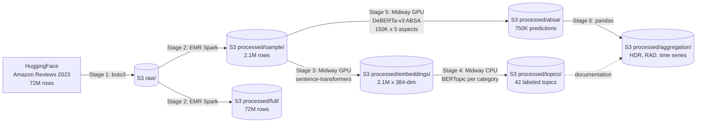

# Beyond the Stars: Mining Hidden Dissatisfaction in Amazon Reviews

A large-scale aspect-based sentiment analysis (ABSA) pipeline over 72 million Amazon product reviews (1999–2023). The project quantifies *hidden dissatisfaction*: cases where a customer leaves a 4 or 5-star rating but, in the review text itself, complains about a specific aspect of the product. Star ratings flatten this signal; the pipeline recovers it.

**Repository:** https://github.com/macs30113-s26/final-project-star-rating-and-comments

---

## 1. Research question

Star ratings on e-commerce platforms are noisy. Two reviewers can both give a product five stars while disagreeing strongly about its build quality, its packaging, or its value for money. Sellers and platforms see only the aggregate distribution of stars and miss the structured information embedded in the text. For a category like Beauty and Personal Care — where sensory and packaging concerns matter independently of overall product quality — this loss is substantial.

This project asks: **across product categories that differ in how consumers evaluate them, what fraction of seemingly-satisfied customers (4–5 star reviewers) actually express negative sentiment about specific product aspects, and how does this pattern vary across aspects and over time?**

The framing borrows from Hirschman and Holbrook's (1982) classic distinction between utilitarian, hedonic, and sensory product evaluation. Three categories were chosen to span this axis:

- **Beauty and Personal Care** (sensory) — 23.9M reviews
- **Video Games** (hedonic) — 4.6M reviews
- **Electronics** (utilitarian) — 43.9M reviews

I define two metrics to make the question precise:

**Hidden Dissatisfaction Rate (HDR)** — among reviews with rating ≥ 4 stars, the fraction expressing negative sentiment toward a specific aspect. High HDR means satisfied customers are quietly complaining.

**Rating-Aspect Discrepancy (RAD)** — the gap between a reviewer's normalized rating and their normalized sentiment on a specific aspect. Positive RAD means the star rating overestimates satisfaction with that aspect.

---

## 2. Why scalable computing is necessary

The raw Amazon Reviews 2023 dataset is 72M rows across the three chosen categories alone, roughly 35 GB compressed JSONL after download. Three properties of the analysis force a distributed pipeline rather than a single-machine workflow:

1. **Ingestion** — pulling 35 GB from HuggingFace and writing it to durable storage is bandwidth-bound but trivially parallelizable across categories. Acquisition runs as a `boto3` streaming uploader to S3.

2. **ETL and sampling** — schema normalization, type casting, and stratified sampling across rating × year strata must scan the full 72M rows once. PySpark on EMR (4-node `m5.xlarge` cluster) handles this in roughly 30 minutes of cluster wall time; on a single laptop it would take several hours and stress local disk.

3. **Neural inference** — both Stage 3 (sentence embeddings on 2.1M reviews) and Stage 5 (ABSA on 750K text-aspect pairs) are GPU-bound transformer workloads. Single-card V100/A100 GPUs on Midway 3 process the workload in 1–2 hours per stage; a CPU-only run would take days.

The pipeline alternates deliberately between two clusters: **AWS EMR + S3** for batch ETL and storage, and **Midway 3 (Slurm)** for GPU-heavy and memory-heavy steps. S3 acts as the durable interchange layer; every stage reads from and writes to S3 so that any single stage can be restarted independently. Intermediate outputs are written as Parquet to keep file sizes manageable and reads cheap.

Total compute used:

- ~3 hours EMR (Stage 2 cluster lifetime)
- ~3 hours Midway GPU (Stages 3 and 5 combined)
- ~30 minutes Midway CPU (Stage 4)
- Local pandas for Stage 6 (data is 50 MB after sampling, so single-machine is the right tool)

---

## 3. Architecture



S3 in the middle, EMR on the left for batch work, Midway on the right for neural work. Stage 4's BERTopic output is preserved for documentation purposes but is not on the critical path to the final HDR/RAD tables — see Section 6 (Limitations) for why.

---

## 4. Pipeline stages

Each stage lives in its own numbered subdirectory. Slurm Job IDs for the runs that produced the final results are catalogued in `docs/slurm_jobs.md`.

### Stage 1 — Acquisition (`1_acquisition/`)

`download_to_s3.py` streams the three category JSONL.gz files from the McAuley Lab's HuggingFace mirror straight into S3, never touching local disk for the full files. Wall time ~2 hours, bandwidth-bound.

### Stage 2 — ETL and sampling (`2_etl/`)

`etl.py` runs as a PySpark job on EMR. It reads raw JSONL from S3, casts numeric columns, drops malformed rows, derives `year` and `word_count`, repartitions by category, and writes both the full normalized set (`processed/full/`) and a stratified sample balanced across the five rating levels (`processed/sample/`, 2.1M rows total, ~700K per category). `launch_emr_cluster.py` programmatically spins up the cluster, submits the step, and tears it down on completion.

### Stage 3 — Sentence embeddings (`3_embeddings/`)

`embed_reviews.py` runs `sentence-transformers/all-MiniLM-L6-v2` (384-dim) over the 2.1M sampled reviews on a single Midway GPU. Output is `embeddings.npy` (3.2 GB) plus a `metadata.parquet` with `review_id, category, rating`.
**Slurm Job ID: 50113902** (gpu partition, ~1.5h).

### Stage 4 — Aspect discovery (`4_topics/`)

`discover_topics.py` runs BERTopic per category on Midway CPU. Pipeline: UMAP (cosine) → HDBSCAN (`min_cluster_size=1000`, `core_dist_n_jobs=1` to fit in memory) → cTF-IDF with English stop words and bigram features. Output is one JSON per category with topic IDs, top words, example documents, and a `label` field manually filled in by the author. Forty-two topics across the three categories. `push_labels.py` validates that labels are non-empty before uploading to S3.
**Slurm Job ID: 50185214** (caslake partition, 128 GB RAM, ~30 min).

Note: an earlier attempt (50147001) produced topics dominated by stop words; the rerun added a CountVectorizer with bigrams and English stop-word filtering. Both attempts are visible in the git commit history.

### Stage 5 — Aspect-based sentiment analysis (`5_absa/`)

`absa.py` runs `yangheng/deberta-v3-base-absa-v1.1` on a Midway GPU. Each of 150K stratified-sampled reviews is scored against five universal aspects — **quality, value, shipping, durability, usability** — producing 750K (text, aspect) predictions. Sentiment label and softmax confidence are saved.

I chose universal aspects rather than the BERTopic-derived topics from Stage 4 because the discovered topics turned out to be product *subcategories* (e.g. "Eye Makeup", "Gaming Headsets") rather than evaluation aspects (see Limitations). Universal aspects are also cross-category comparable, which the research question requires.
**Slurm Job ID: 50204546** (gpu partition, 1h 13min).

### Stage 6 — Aggregation and visualization (`6_aggregation/`)

`hdr_analysis.ipynb` is a pandas notebook that computes HDR and RAD per (category, aspect) and per (category, aspect, year), plus heatmap and time-series visualizations. Output CSVs are pushed to S3 under `processed/aggregation/`. The notebook is the deliverable — its rendered outputs are committed for grading.

Pandas is the right tool here even after a course about distributed computing: the post-sampling data is 750K rows (~50 MB), single-machine aggregation runs in seconds, and a Spark cluster spin-up would be 10× the actual compute time. Stage 2 already demonstrated EMR Spark on the full 72M-row corpus.

---

## 5. Findings

### Headline result: stars overestimate satisfaction on everything except value.

**Rating-Aspect Discrepancy (RAD)** — positive means star rating overestimates aspect sentiment:

| Category | quality | shipping | durability | usability | **value** |
|---|---|---|---|---|---|
| Beauty | +0.15 | +0.16 | +0.12 | +0.10 | **−0.001** |
| Electronics | +0.13 | +0.15 | +0.13 | +0.13 | **−0.002** |
| Video Games | +0.13 | +0.14 | +0.14 | +0.14 | **+0.005** |

Across all three categories and four of the five aspects, the star rating systematically overestimates a reviewer's sentiment toward the specific aspect (RAD between +0.10 and +0.16). On **value**, the gap collapses to essentially zero. The interpretation: when a customer gives 4–5 stars, the rating principally conveys "the purchase was worth what I paid," not "the product has no flaws."

### Hidden Dissatisfaction Rate (HDR) — among 4–5 star reviews, fraction expressing negative aspect sentiment:

| Category | quality | shipping | durability | usability | value |
|---|---|---|---|---|---|
| Beauty | **16.4%** | 15.5% | 14.5% | 13.7% | 9.9% |
| Electronics | 16.1% | 15.5% | 15.4% | 15.1% | 10.5% |
| Video Games | **16.6%** | 15.5% | 15.9% | 16.2% | 10.9% |

Roughly one in six high-rated reviews quietly complains about quality. Value is consistently the lowest-HDR aspect (~10%), reinforcing the RAD finding.

### Cross-category differences are smaller than expected.

The original Hirschman-Holbrook hypothesis would predict that sensory (Beauty) and hedonic (Video Games) categories diverge from utilitarian (Electronics) on which aspects dominate. The HDR table shows surprisingly similar profiles — within 1–2 percentage points per aspect cell. The discrepancy is mainly *within* a category (which aspect is hidden) rather than *between* categories. That null result is worth reporting honestly.

### Time series

Faceted line plots in the notebook (`6_aggregation/hdr_analysis.ipynb`) show HDR drifting upward on durability and shipping aspects since roughly 2015 across all three categories. Modern reviewers appear more willing to flag specific problems while still leaving 4–5 stars.

---

## 6. Limitations and honest reporting

1. **ABSA model polarization.** Across every (category, aspect) cell, the label distribution is approximately 55% Negative / 44% Positive / 1% Neutral, and this ratio is suspiciously uniform across all cells. Two plausible causes: the model rarely predicts Neutral on conversational review text, and when an aspect is not actually discussed, the model falls back on overall review sentiment. **Absolute HDR values are likely inflated** for this reason. Relative comparisons across aspects and categories remain interpretable because the bias applies uniformly.

2. **Stage 4 topics are product subcategories, not aspects.** Unsupervised topic discovery over review text clustered reviews by what product they were about (e.g. "Nail Drills", "Console Hardware") rather than by what aspect of a product they discussed. This is a noted issue with applying BERTopic to product reviews and motivated the switch to a fixed universal aspect taxonomy in Stage 5. The discovered topics are kept in `processed/topics/` for documentation and for possible future per-subcategory drill-down analysis.

3. **Stratified sample is balanced by rating.** Stage 2 deliberately oversamples low-rating reviews to guarantee enough 1–3 star reviews for any rating-conditional metric. The natural Amazon distribution is heavily skewed toward 5 stars. Raw counts in this analysis therefore cannot be extrapolated to population-level prevalence.

4. **Single-rater topic labels.** All 42 BERTopic topic labels were assigned by a single rater (the author). A multi-rater study with inter-annotator agreement would strengthen this step but was infeasible within the project timeline.

5. **Domain shift in the ABSA model.** `yangheng/deberta-v3-base-absa-v1.1` was trained on restaurant and laptop reviews. Applying it to Beauty reviews involves a domain shift; some accuracy loss is expected and not measured here.

---

## 7. Reproducibility

### Prerequisites

- Python 3.9+ and the packages in `requirements.txt`
- An AWS account with permission to create S3 buckets and EMR clusters (project used AWS Academy Learner Lab)
- A Midway 3 account on the `macs30113` allocation (or any cluster with `gpu` and `caslake`-equivalent partitions)

### End-to-end run

```bash
# Stage 1: ingest raw data to S3 (~2 hours, bandwidth-bound)
python 1_acquisition/download_to_s3.py --bucket <your-bucket>

# Stage 2: EMR Spark ETL + stratified sampling (~30 min compute)
python 2_etl/launch_emr_cluster.py

# Stage 3: embeddings on Midway GPU (~1.5 hours)
sbatch 3_embeddings/slurm_embed.sbatch

# Stage 4: topic discovery on Midway CPU (~30 min) followed by manual labeling
sbatch 4_topics/slurm_topics.sbatch
# manually fill 'label' field in 4_topics/labels/topics_*.json
python 4_topics/push_labels.py --bucket <your-bucket>

# Stage 5: ABSA on Midway GPU (~1h 15min)
sbatch 5_absa/slurm_absa.sbatch

# Stage 6: aggregation + visualization (local, ~2 min)
jupyter notebook 6_aggregation/hdr_analysis.ipynb
```

Each stage reads from and writes to S3, so any single stage can be re-executed independently provided the previous stage's outputs are intact in S3.

### Iterative development trail

Per the project rubric requirement, Slurm Job IDs for successful final runs are recorded in `docs/slurm_jobs.md`. The full iterative development trail — including failed earlier attempts at each Slurm-driven stage and the fixes that resolved them — is visible in the git commit history of this repository.

---

## 8. Repository structure

```
final-project-star-rating-and-comments/
├── README.md                          this file
├── requirements.txt
├── .gitignore
├── docs/
│   └── slurm_jobs.md                  Job IDs for successful final runs
├── 1_acquisition/
│   └── download_to_s3.py
├── 2_etl/
│   ├── etl.py                         PySpark ETL + stratified sampling
│   └── launch_emr_cluster.py
├── 3_embeddings/
│   ├── embed_reviews.py
│   └── slurm_embed.sbatch
├── 4_topics/
│   ├── discover_topics.py             BERTopic per category
│   ├── slurm_topics.sbatch
│   ├── push_labels.py
│   └── labels/                        manually filled topic labels
├── 5_absa/
│   ├── absa.py                        DeBERTa-v3 ABSA inference
│   └── slurm_absa.sbatch
└── 6_aggregation/
    └── hdr_analysis.ipynb             HDR/RAD + visualizations
```

---

## 9. References

- Hirschman, E. C., & Holbrook, M. B. (1982). Hedonic Consumption: Emerging Concepts, Methods and Propositions. *Journal of Marketing*, 46(3), 92–101.
- Hou, Y., Li, J., He, Z., Yan, A., Chen, X., & McAuley, J. (2024). Bridging Language and Items for Retrieval and Recommendation. arXiv:2403.03952. (Amazon Reviews 2023 dataset paper.)
- Grootendorst, M. (2022). BERTopic: Neural topic modeling with a class-based TF-IDF procedure. arXiv:2203.05794.
- Hugging Face. *sentence-transformers/all-MiniLM-L6-v2*. https://huggingface.co/sentence-transformers/all-MiniLM-L6-v2
- Hugging Face. *yangheng/deberta-v3-base-absa-v1.1*. https://huggingface.co/yangheng/deberta-v3-base-absa-v1.1
- McAuley Lab, UC San Diego. *Amazon Reviews 2023*. https://amazon-reviews-2023.github.io/

---

## 10. Author and AI disclosure

This is a solo project. All code, analysis, and writing are the work of the author; all design and methodological decisions are the author's responsibility.

The project was developed with assistance from Anthropic's Claude during the planning, scaffolding, and debugging phases. Claude helped with architectural sketches, drafting of this README, code review, and debugging compute-cluster errors. All code was reviewed and executed by the author; all interpretive claims about the data are the author's own.
